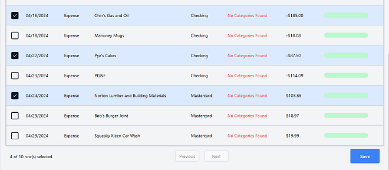

# Clasibot - Transaction Classifier

- [**Project Description**](#project-description)
- [**Tech Stack**](#tech-stack)
- [**Project Architecture**](#project-architecture)
- [**Components of the App**](#components-of-the-app)
- [**Project Setup**](#project-setup)
- [**App Development Info**](#app-development-info)

## **Project Description**

### **The Goal:**

The goal of this project is to merge traditional online accounting tools with machine learning to assist with transaction classification.

### **The Problem:**

Transactions need to be classified into certain categories for tax purposes at the end of the year. Modern bookkeeping tools help with this process by identifying repeated transactions and using prior classifications.

Unfortunately, even these tools are often slow and tedious to use. They often require the bookkeeper to manually approve every transaction by selecting a specific option amongst the other bookkeeping data. While faster than traditional methods, this can build up for larger business or accounting for multiple clients.

### **The Solution:**

Clasibot aims to handle two of the major issues that cause classification to be an unpleasant process. The first step is the use of an machine learning algorithm trained on a combination of data. The system uses a three step process to quickly classify transactions while abstracting the process away from the user.

The application also focuses on a simple to use interface that makes it easy to quickly classify a large number of transaction. In combination with API integration with QuickBooks (a large accounting software company) the app offers a seamless user experience that offers fast and easy way to accomplish this tedious task.

- Step 1: Application checks against prior transactions from that user to look for ones with names that match or are similar to the new transactions being classified.

- Step 2: Checks against a database of anonymous data from across all Clasibot users. Finds any matching transactions and returns a list of the top categorizations.

- Step 3: A new step in the bookkeeping process introduced by Clasibot, machine learning classification prediction. Using the transaction name, a set of information is generated by making use of Google's custom search and knowledge graph API's.

  - This information can be fed into the machine learning model, along with the users prior transactions, to create a prediction for any transaction. This allows the app to classify transactions with a name that is not present in either the users prior transactions or the database of classified transactions.

### **Classification Pipeline**

## **Tech Stack**

- **Programming Language:**

  - Typescript

- **Frameworks:**

  - React
  - Tailwind CSS
  - Postgres Database
  - Shadcn Components
  - Radix-UI Components

- **APIs:**

  - Next Auth
  - QuickBooks Online
  - Google Custom Search
  - Google Knowledge Graph

- **LLM's**

  - Gemini-1.5-Flash
  - OpenAI GPT 3.5 Turbo

- **Tools:**

  - ESlint Code Analyzer
  - Ruff Formatter
  - Sentry (Error Handling)
  - Prisma ORM
  - Docker

- **Computational Resources:**
  - Local Machine Learning Server
    - Ability to maintain a continuous uptime for the hosted site.
    - Power to train, develop and deploy the model on large data sets.

## **Project Architecture**

- **`env.example`**

  Defines the environment variables used throughout the site and what they are used for. Environment variables for the same elements or similar functionalities are grouped together.

- **`tailwind.config.ts`**

  Configures the tailwind design elements such as standard screen sizes and element spacings. Can be modified to include custom values to use in tailwind class names.

- **Src**

  - `middleware.ts`
  
    Configures how the Auth middleware handles redirects non-logged in users to view a landing page and redirect back to the landing page if they visit any other page. Also defines the behavior for when the user signs in through QuickBooks.

- **Actions**

  - **LLM Prediction:**
    Create LLM predictions or supply information used in predictions.

    - `customSearch.ts`

      Calls the Google custom search API to search for information about a passed query (a transaction).

    - `knowlegeGraph.ts`

      Calls the Google knowledge graph API to get information about a passed query by looking for element related through the knowledge graph.

    - `llm.ts`

      Defines the prompts and instructions for the LLM as well as functions to query a single transaction or a batch of transactions.

  - **Stripe:**
    Interact with the stripe payment API

    - `check-subscription.ts`

      Checks the current session to see if the user has a payed subscription or free trial and returns status and validity results.

    - `create-customer-ID.ts`

      Creates a new ID in stripe for a paying user and updates the users information in the database with the stripe information.

    - `create-customer-session.ts`

      Creates a new stripe session for the user to allow the app to check the current users subscription status.

    - `index.ts`

      Exports the stripe actions as a single file.

  - **Transaction Database:**
    Work with the database of user transactions

    - `add-transactions.ts`

      Takes a group of classified transactions and updates the values of existing transactions that match or creates a new transaction in the database if one is not present. Converts passed transaction to basic QuickBooks categories to remove user inputted names.

    - `index.ts`

      Exports the transaction actions as a single file.

    - `search-database.ts`

      Looks for a transaction in the database by its name and finds the top 3 categories (and their related accounts) for that transaction then returns them as a list.

  - **Quickbooks.ts**
    Interacts with QuickBooks API + Helper functions.

    - `get-accounts.ts`

      A QuickBooks API call that gets the users accounts, the QuickBooks element that defines the possible classifications a user can assign to a transaction. It formats results to the Account specified type and returns the results as a JSON object.

    - `get-transactions`

      A QuickBooks API call that gets the users transactions within a specified date range (default of 2 years). Returned transactions must be of specified types related to expenses and must contain a name and amount value. It formats results to the Transaction type and returns the results as a JSON object.

    - `helpers.ts`

      - **Check Fault Property**

        A helper function that checks QuickBooks API response to see if they are errors.

      - **Create Query Result**

        A helper function that creates a standardized header to be returned along with API call functions that informs the function caller of the result of the API call. Either returns a standardized success message or a failure result with the API failure message and details.

    - `purchases.ts`

      - **Find Purchase** / **Find Formatted Purchase**

        A QuickBooks API call. The different methods formats the results to one of two type objects depending on which is called. Used in conjunction with the update purchase function to save transactions. Finds a specific purchase based off a transaction ID and returns it as either the QuickBooks response or a Purchase type object.

      - **updatePurchase**

        Works in conjunction with the `Find Purchase` functions and the returned QBO object from that method. Takes a QuickBooks Purchase object with an updated account ID and updates the transaction related to that Purchase.

    - `user-info.ts`

      - **Find Industry**

        Uses the users information to find the industry type related to their account. This is one of a set list of types defined by QuickBooks that all companies assign when created.

      - **Get Company Name**

        Uses the user details element of the API to fetch the name of the company currently selected by the user. Needed for clarity for users linked to multiple companies as many bookkeepers are.

  - **Other**

    - `classify.ts`

      Creates the basic classification pipeline for classifying with fuse against user transactions, then against database transactions, then using the LLM to classify. Defines a function for the classification pipeline, for the fuse classification section, and for the LLM classification section. Also defines some helper functions for fetching categories, creating a fuse instance, and for calling the LLM.

    - `contact.ts`

      The action that handles the contact us page by converting the form into an email that is sent to the Clasibot email through Node Mailer. Also returns a message indicating the Node Mailer's success.

    - `qbclients.ts`

      Defines the creation of the QBO object that is used to call the QuickBooks API. Primarily acts a helper method for other actions like the `quickbooks.ts` file.

- **App**

  - `layout.tsx`

    Defines how the basic layout of the app's pages are constructed, with a navbar, main content, footer, a toaster component, and an analytics component that reports errors to Sentry.

  - `not-found.tsx`

    Defines the content to be displayed on the 404 page with a redirect to the home (or landing) page.

  - `page.txs`

    The tailwind file for the landing page with the title, call to action, and the sign in button.

  - **API**

    - `auth/next-auth/options.ts`

      Defines the options needed to make calls to the next-auth functions such as getting the session.

    - `auth/next-auth/route.ts`

      Exports an API call to next-auth that signs a user into QuickBooks and stores the realmID (needed for the QBO object) in the session.

    - `checkout/route.ts`

      Exports a call to Stripe payment to checkout users who have paid for a subscription and update the session with their new status.

    - `cse/route.ts`

      Exports the call to the custom search engine provided by Google that is used in LLM transaction classification.

    - `ks/route.ts`

      Exports the call to Google's knowledge graph which is used in the LLM to provide context for classification predictions.

    - `llm/batch/route.ts`

      Exports a call to the LLM to classify a batch of transactions and returns the resulting classifications.

    - `llm/single/route.ts`

      Exports a call to the LLM to instead classify a single transaction and get the results. Mostly used for testing as batch can handle a batch of size one.

    - `quickbooks/get-accounts/route.ts`

      A testing endpoint that gets the list of accounts for the current user. Useful for resolving issues or updating functionality of QuickBooks API actions.

    - `quickbooks/get-transactions/route.ts`

      Another testing endpoint that gets the list of transactions for the current user.

    - `update-industry/route.ts`

      Exports an endpoint that can be called by the home page to update the users industry in the database based on the value returned by a get_industry QuickBooks action call.

  - **Other**

    - `contact-us/page.tsx`

      Defines the content to be displayed in the contact us page, with the contact form, submission button, and return button that takes the user to the landing page or home page. Also defines the behavior of the contact us form and the submission button.

    - `home/page.tsx`

      Defines the basic layout of the home page by containing a home page object that defines the interior content. Also displays a pricing table on the left hand side for users who do not have a valid subscription to allow them to purchase one and continue using the site.

    - `privacy-policy/page.tsx`

      Defines a basic privacy policy page by using a react component to convert a markdown datafile into a visual component. Also has a return to home button at the bottom that takes users to the appropriate page (landing or home). `Privacy policy` folder also contains the markdown file to be displayed.

    - `terms-of-service/page.tsx`

      Defines a simple terms of service page using the same method and return button as the privacy policy page. Like the privacy policy, the `terms of service` folder also contains the markdown file to be displayed.

  - **Components**

    - **Data Table**

      - `columns.txs`

        Defines 4 important elements for the data tables that display the transactions.

        1. The sortable button that allows the user to change the sorting method of certain columns.
        2. A set of common columns used by both the review and selection tables. Includes a column for the select all button and the individual selection buttons for each row. Also defines the date row and a custom filtering method to handle the date formatting.
        3. Defines the columns used in the selection table with a combination of the common columns and newly defined selection specific columns.
        4. Defines the columns displayed in the review table which includes the unique categories and confidence value columns in addition to the common ones.

           - Also includes an identical definition for the account column. This is necessary for the custom filter function defined for that column to function.

      - `review-table.tsx`

        Defines the content of the review table that is displayed inside the review page. Includes definitions for the filtering functions available to the user (name and accounts). Also includes functionality needed for the account filtering to work as well as a call to the react table element that passes the necessary data and callback functions.

      - `selection-table.tsx`

        Like the review table, defines how to display the content inside the table, makes a call to the react table with the needed parameters, and defines the account selection functionality. In addition, it adds 2 other filtering inputs (date and columns shown) as well as the functionality required for those filters. Additional filters are needed for selection which may consist of more options than the user wants to classify.

    - **Home**

      - `index.tsx`

        Defines the basic layout of the home page, including how the selection and review pages are displayed and how to switch between them. Also includes key functionality for checking and updating the users industry, displaying the current company name, and checking the users subscription status.

        It then makes a call to get the users last 5 years of transactions that will be used as the user reference data for the classification pipeline. Finally, it defines callback functions for the review and selection tables to use (create categorized transactions, handling classification, and setting the a state for when the selection table is classifying.)

      - `review-page.tsx`

        Defines the basic layout of the page, include a title and a modal element that displays after classifications are saved. Modal can display error or success messages along side a button that returns the user to the selection page. Also defines the behavior to initialize the categories found for each transaction, handle the user changing the selected categories, handling saving the users selected transactions, and displaying the modal after saving finishes with an appropriate message. Also calls the review table and passes the necessary data and callback functions.

      - `selection-page.tsx`

        Simpler than the review page, the selection page just defines the basic layout of the page including the title and the selection table. It defines the functionality for fetching the transactions for the user to classify (including fetching new ones when the user changes the date range). It then calls the selection table and passes the necessary data and callbacks to its table as well.

    - **UI**

      - Contains components from the libraries that used across the site.

        - `Toast` - Contains the toast library related files.

        - `Other` - Contains components from React, Radix-UI, and Shadcn.

    - **Inputs**

      - `change-company-button.txs`

        A modified sign in button that takes advantage of the session to direct logged in users directly to the QuickBooks page where they can select (change) their company to another one connected to the account.

      - `date-picker.tsx`

        Defines a simple date picker input element that is used to select the range of dates to fetch transactions from on the selection page.

      - `home-button.tsx`

        A simple button design that redirects the users to either the landing or home page as appropriate.

      - `sign-in-button.tsx`

        Defines the how the sign in button on the landing page is displayed.

      - `sign-out-button.tsx`

        Defines a button for the navbar that will sign the user out of their account and return them to the landing page.

    - **Site Elements**
        
      - `footer.tsx`

        Defines the layout and design of the footer which includes copyright information as well as links to the 'contact us', 'privacy policy' and 'terms of service' pages.

      - `nav-bar.tsx`

        Defines the design of the navbar for both the landing page (non-logged in users) and the home page (logged in users), including a logo, title, and subtitle in both. The home page navbar also includes a button to switch companies, some user information, an account management button, and an option for the user to sign out.

      - `pricing-table.tsx`

        Calls information from Stripe to get the pricing of a Clasibot subscription and defines how to display it to the user in a way they can interact with.

    - **Other**

      - `confidence-bar.tsx`

        A shadcn component that displays a green progress bar with a hover card that displays on top when the user hovers over it. Used to denote how confident the prediction is by the way it was created.

      - `markdown.tsx`

        Defines how do render the markdown files used by `privacy policy` and `terms of service` as react elements to be rendered onto the page.

      - `spinner.tsx`

        Defines a basic loading animation to be displayed when classifying or saving transactions on the home page.

      - `unpaid-alert.tsx`

        Defines an alert to be displayed to the user if they try to classify transactions without a valid subscription.

  - **Site Config**

    - `site.ts`

      Defines basic information about the site, including the site name, description, and footer items. Also sets a href associated with the footer items that is used to allow non-logged in users to access them through the middleware.

  <!-- - **Lib**

    - `db.ts`

      Sets up the Prisma database to be used throughout the app.

    - `refresh-token.ts`

      A function that makes an API call to Intuit (QuickBooks) OAuth to get a new access token by making use of the refresh token.

  - **Prisma**

    - `schema.prisma`

      Defines the schema of the Prisma database. Defines user information, subscription information that is associated with a user, the transactions saved to the database for the second step of the pipeline, and the classifications associated with the saved transactions. -->

  - **Types**

    - `Account.ts`

      Defines a standardized formatting for the data of an individual QuickBooks account. Created from the data that is returned by the get_accounts function that makes a call to the QuickBooks API.

    - `CategorizedResults.ts`

      Defines a standardized formatting for categorized results created for fetched transactions. Defines the transaction it is related to by its ID, the array of classifications created, and how it was classified.

    - `Category.ts`

      Defines a standard for potential categories by connecting a name to an account ID in QuickBooks. Also defines a classified category that was created by the classification pipeline that includes how it was created.

    - `Purchase.ts`

      Defines a set of key information relating to a purchase object from the QuickBooks API. This is potentially returned by the `findFormattedPurchase` function in the `purchase.ts` folder within the QuickBooks actions but is currently unused. It would define the important information from the purchase into a formatted type while also including a transaction result object within the purchase object.

    - `PurchaseResult.ts`

      Defines a type for the unformatted result returned by the presently used `findPurchase` function in the `purchase.ts` file in the QuickBooks actions. Defines the key information needed to make a purchase update query as well as some other notable data about the purchase. Also defines an error object to make error handling in calling functions easier.

    - `QueryResult.ts`

      A standardized format for a response that indicates if a call to the QuickBooks API was successful. It is either returned from calls to the QuickBooks action functions or as a part of other types returned those functions. The success message is set statically whereas the error message has a static result value, but the message and details are pulled from the QuickBooks response.

    - `Transaction.ts`

      The standardized format for the final kind of QuickBooks data returned from the API calls. Transactions contain a category by default, and uncategorized transactions have the category 'uncategorized expense'. It also defines a type for transactions that have been classified by the pipeline and replaces the 'classification' value with a 'classifications' value that contains an array of the top 3 classifications found.

  - **Utils**

    - `filter-transaction.ts`

      Two simple utility functions that take a list of transactions and remove either all the transactions that ARE classified as 'uncategorized expense' or removes the transactions NOT classified as 'uncategorized expense'. The first is used for the selection page, whereas the second is used as part of the handle classification callback to filter out the transactions that could not be classified.

## **Components of the App**

This a brief overview each element of the app that a user would encounter and each of them work.

- **Navbar**

  - **Landing Page**

  The logo and text on the left side of the navbar will redirect the user back to the home or landing page. This is a quicker way to return from the _'contact us'_, _'privacy policy'_, and '_terms of service'_ pages.

  

  - **Home**

  The switch company button will return the user to the QuickBooks company selection page

  When the user is logged in, it will display the name of the user connected to the QuickBooks account.

  Depending on whether the user has a subscription, it will then inform the user if their account is active or not.

  The sign out button ends the current session for the user and returns them to the landing page.

  

  The manage account button redirects users to a Stripe page where they can enter their email to have a link to their Stripe account page sent to them. This will let the user manage their account and payment directly with Stripe.

  The switch company button will redirect users to a QuickBooks page where they can select a company that is linked to their account _(more below)_. This lets users quickly switch between classifying transactions for multiple companies.

  

- **Footer**

  The footer contains a brief copyright message as well as links to the _'contact us'_, _'privacy policy'_, and _'terms of service'_ pages.

  Despite displaying 'inside' the navbar, the bug report button is a separate element not contained in the footer file.

  

- **Bug Report**

  The bug report feature to send a short message (along with their name and email) containing a description of any bugs they encounter.

  These messages are passed along to sentry where they can be viewed. The user may choose to also attach a screenshot to the bug report to give additional context

  

- **Landing Page**

  The landing page is very minimal in function, mostly aiming to direct users to the QuickBooks sign in.

  It consists of just a simple display of the app's name, a call to action, and a sign in button that redirects to QuickBook login page.

  

- **Contact Us**

  This page allows users to contact us directly by filling out a form. First the user must enter their email, the reason for contact, and the message they want to send. Then the message is sent as an email to Clasibot's official contact email **contact@clasibot.com**.

  

- **QuickBooks**

  - **Sign In**

    Assuming the user already has a QuickBooks account _(a requirement to use the app anyways)_ signing in is a very simple process that involves entering the accounts email, followed by a new page where they enter their password.

    

  - **Select Company**

    Once the user has signed into their account, they may select the company they wish to connect to the app. This is useful for bookkeepers who may be connected to many companies that they do bookkeeping for.

    This also is the page the user will be redirected to when a logged in user selects the _'switch company'_ button, as mentioned above.

    

- **Selection**

  The selection page is where the user can decide which transactions they want to classify. A set of unclassified transactions _(past two years by default)_ are loaded and shown to the user. The user may then look through the loaded transactions and select the ones that should be classified.

  When the user first loads the page, they will be greeted by four filtering options.

  1. Filtering by name will only show transactions whose name includes the search parameter.

  2. The date filters allow the user to select a range of dates to classify the transactions from. Whenever the user updates these values, a new set of transactions is fetched to include all transactions in the specified date range.

  3. The accounts filter lets the user filter transactions by which account the expense was related to. If the user has multiple cards or bank accounts connected to their account, this lets them select which accounts they want to view the transactions from.

  4. The columns filter does not remove any rows of data, but instead which columns of data are shown for each row. The only column that cannot be hidden is the 'name' column that identifies the transactions.

  

  Once the user has select the transactions they want to classify the current page, they can scroll down to the bottom. This shows the user how many transactions they have seen as well as how many transactions there are total.

  The pagination buttons allows the user to look through the transactions in batches of 10, selecting any transactions they want to classify.

  Finally, once the user is satisfied with their selections, they can click the classify button to send the transactions through the classification pipeline. The page will load a bit on this step, then direct the user to the review page.

  

- **Review**

  The goal of the review page is for the user to review the transactions with their new classifications. For transactions with multiple classification results, they can select which one fits best. Otherwise they can simply select the ones that were classified correctly and save them to QuickBooks.

  When the user first loads the page, they will be greeted by only two filtering options.

  1. Filtering by name will only show transactions whose name includes the search parameter.

  2. Filtering by account will only show transactions from the accounts selected within the dropdown menu.

  These options help to review the classifications in a organized manner and allow for and make it easier for the user to review their transactions.

  

  Once the user has selected the classification they want for each transaction and selected the transactions they want to save from the current page, they can scroll down to the bottom. This shows the user how many transactions they have seen as well as how many transactions there are total.

  The pagination buttons allows the user to look through the transactions in batches of 10, selecting any transactions they want to save.

  Finally, once the user is satisfied with their selections, they can click the save button to update the the transactions in QuickBooks with the new classifications. The page will load for a bit, then display a result pop-up.

  

  Once the transactions are successfully updated a message will display informing the user of the success and redirecting them back to the selection page.

  This is designed to make it easy for users to repeatedly classify and save transactions, then switch to a different company to continue.

  In the event that the saving failed, an error pop-up will appear instead alongside an appropriate error message generated by the page.

  

## **Project Setup**

How to get the project running on a new machine.

1. Clone the GitHub repository into a new repository in a local folder.

2. Open a terminal in your IDE.

3. Run `cd ./frontend/` to navigate to the frontend folder that contains the majority of Clasibot's files.

4. Run `npm i` to install the packages used by the app.

5. Run `npm run dev` to launch the app on a localhost port.

6. Open the local host port _(Default: 3000)_ to check that the app is running.

7. If the app is running and the landing page is displayed, the project setup is complete.

## **App Development Info**

- **Important Terminal Commands**

  - _Note: All commands should be run under the frontend directory_

  - `cd ./frontend/` - Navigate terminal to frontend folder.

  - `npm i` - Installs all packages used by the application.

  - `npm run dev` - Build app and host it locally in the development mode. After launching, the localhost port _(Default: 3000)_ being used is shown in the terminal.

  - `npm run build` - Builds the app in production mode similar to `npm run dev` but does not host it.

  - `npm next start` - Runs the app built by `npm run build` to host the app locally.

  - `npm run format` - Runs a prettier check on all files and automatically updates them with the correct formatting. Use `npm run format:check` to get the issues without automatic changes.

  - `npm run lint` - Runs lint code checker and displays a list of warnings and errors in the terminal.

  - `npm run db:generate` -

  - `npm run db:migrate` -

  - `npm run db:push` -

  - `npm run studio` -

- **Other Information**

  - Read `.env.example` for a template containing the app's env values and a brief explanation of their use.
